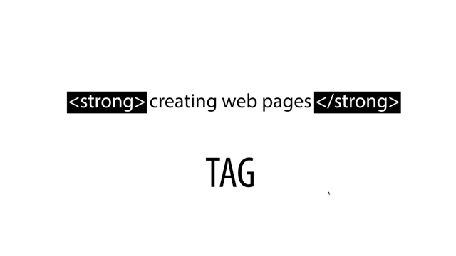

# Day 26

## WEB
웹 페이지를 만드는 가장 중요한 규칙을 살펴보자.

---
### 기본 문법 - 태그
html 아래와 같은 내용을 저장한 후 웹 브라우저에서 불러온다.
```html
Hypertext Markup Language (HTML) is the standard markup language for creating web pages and web applications.
```
### Strong
`<Strong>`은 강조표시가 필요한 부분에 사용한다.
```html
Hypertext Markup Language (HTML) is the standard markup language for <strong>creating web pages and web applications.</strong>
```

### underline
밑줄은 첫 글자를 따서 `<u>`를 사용한다.
```html
Hypertext Markup Language (HTML) is the standard markup language for <strong>creating <u>web</u> pages and web applications.</strong>
```

## 정리



위의 그림에서 `strong`이라는 것을 HTML에서는 문법적인 태그라고 부릅니다.

> **열리는 태그**  
> 앞에 있는 태그

> **닫히는 태그**  
> 뒤에 있는 태그는 태그명 앞에 `/`를 붙혀서 사용한다.

--- 

### 태그의 중첩
```html
<strong>creating <u>web</u> pages and web applications.</strong>
```
위의 코드를 보면 알겠지만 태그는 중첩해서 사용이 가능하다.

### 한글이 깨지면 어떻게 해야 하나요?


```html
<meta charset="utf-8">
```
`<meta charset="utf-8">`를 추가한다. 여러분이 파일을 저장하면 UTF-8로 저장이 됩니다. 그럼 웹브라우저에게 UTF-8로 페이지를 열라고 해줘야 합니다. 그걸 브라우저에게 알려주는 코드입니다.
